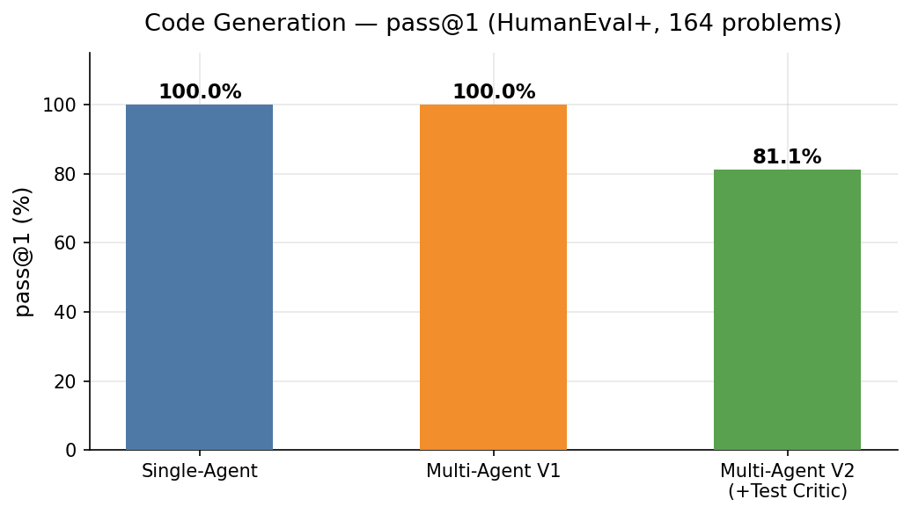
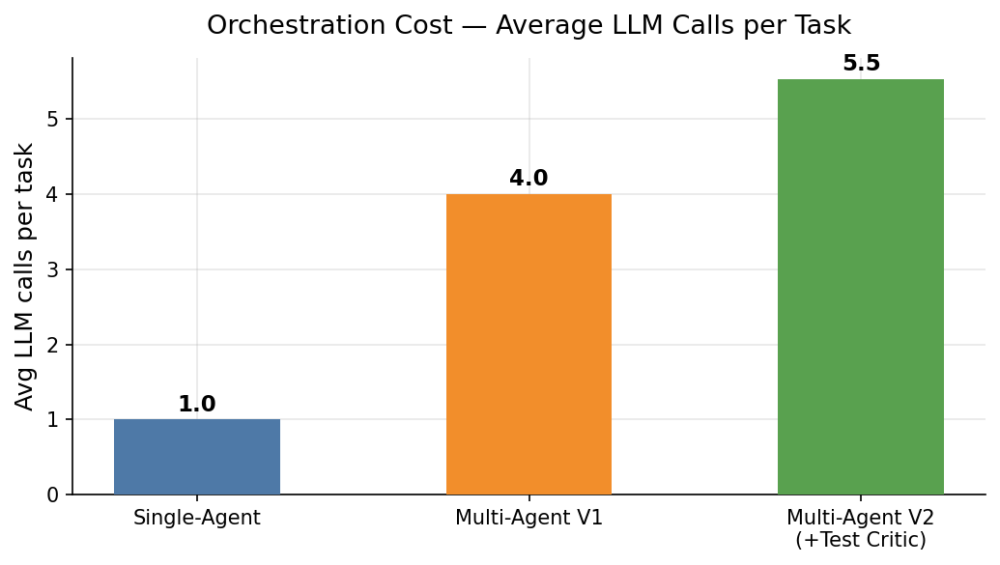
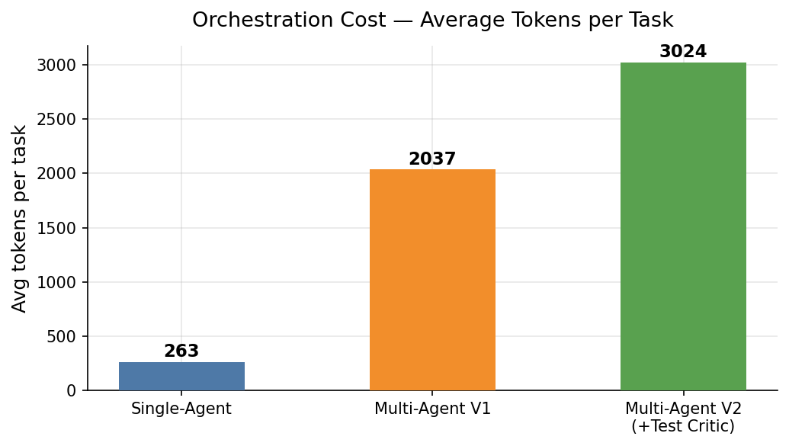
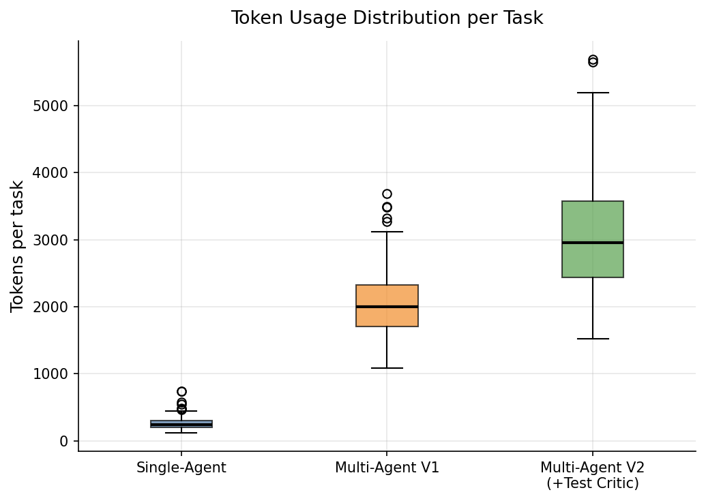
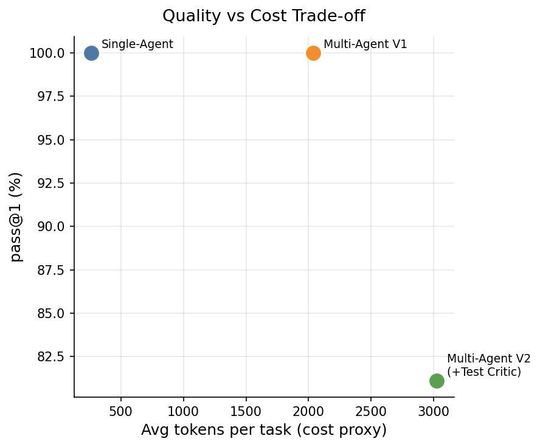
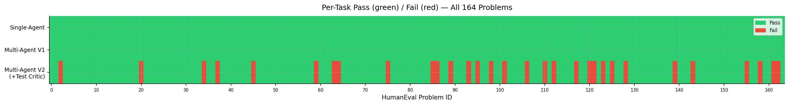

# Full Run Results — Multi-Agent Software Development Assistant

**Dataset:** HumanEval+ (EvalPlus) — 164 problems  
**Model:** `claude-sonnet-4-6`, `temperature=0`  
**Date:** 2026-04-14

---

## 1. Summary Table

| System | pass@1 | pass@1 (%) | Avg LLM Calls | Avg Tokens/Task | Total Tokens |
|---|---|---|---|---|---|
| Single-Agent | 164 / 164 | **100.0%** | 1.00 | 263 | 43,164 |
| Multi-Agent V1 | 164 / 164 | **100.0%** | 4.00 | 2,037 | 334,036 |
| Multi-Agent V2 (+Test Critic) | 133 / 164 | **81.1%** | 5.54 | 3,024 | 496,014 |

---

## 2. pass@1 Comparison

Both Single-Agent and Multi-Agent V1 achieve **100% pass@1** on HumanEval+. Multi-Agent V2 scores **81.1%** — not because the code it generates is worse, but because the Test Critic introduces additional edge-case tests that the original EvalPlus suite does not include. 31 of the 164 problems that passed under V1 are reclassified as failures under V2's augmented test suite.

---

## 3. Orchestration Cost

### LLM Calls per Task

| System | Avg calls | Multiplier vs Single-Agent |
|---|---|---|
| Single-Agent | 1.0 | 1× |
| Multi-Agent V1 | 4.0 | 4× |
| Multi-Agent V2 | 5.5 | 5.5× |

Multi-Agent V1 consistently uses exactly 4 calls per task (Planner + Extractor + Critic + Coder), with no repair loop triggered — all problems were solved on the first attempt. V2 averages 5.5 calls due to the Test Critic running 1–2 times per task.

### Tokens per Task

Multi-Agent V1 uses **7.7× more tokens** than Single-Agent per task. Multi-Agent V2 uses **11.5× more tokens**. The additional overhead in V2 comes primarily from the Test Critic node, which receives the full problem description, implementation, and existing test suite in its prompt.

### Token Distribution

Single-Agent token usage is tightly clustered (low variance) since every task follows the same single-call path. Multi-Agent systems show higher variance — V2 in particular has a long tail driven by problems where the Test Critic ran twice and added substantial additional test code.

---

## 4. Quality vs Cost Trade-off

Under the original EvalPlus evaluation criteria, Single-Agent and Multi-Agent V1 achieve identical quality at 7.7× cost difference. This is the central finding: **for HumanEval+ problems, orchestration overhead does not improve pass@1** — the single-agent baseline is already strong enough to solve all 164 problems in one shot.

Multi-Agent V2 occupies a different position: higher cost, lower reported pass@1 — but this reflects *stricter evaluation* rather than weaker code generation.

---

## 5. Per-Task Pass/Fail Heatmap

Green = Pass, Red = Fail.

- **Single-Agent** and **Multi-Agent V1**: uniform green across all 164 problems
- **Multi-Agent V2**: 31 red cells, concentrated across a range of problem IDs, not clustered — suggesting the Test Critic augments tests broadly rather than targeting specific problem types

---

## 6. Key Finding: The Test Critic Effect

Multi-Agent V2 introduced **31 new failures** that V1 and Single-Agent did not detect. These are problems where:

1. The original EvalPlus test suite was passed by the generated code
2. The Test Critic identified missing coverage (edge cases, boundary values, type variants)
3. The augmented tests revealed a bug in the generated code
4. The repair loop did not recover (budget exhausted or repair failed)

This is a **double-edged result**:

| Interpretation | Implication |
|---|---|
| The Test Critic reveals real bugs | V2's 81.1% is a more accurate picture of true correctness than V1's 100% |
| The Test Critic generates incorrect tests | V2 is penalising correct code with invalid assertions |

Without ground-truth oracle tests to compare against, both interpretations are plausible. A manual review of the 31 failing cases is needed to determine the ratio. This is identified as a key area for future investigation (see [FUTURE_WORK.md](../FUTURE_WORK.md)).

**Conservative conclusion:** Multi-Agent V2's lower pass@1 on easy problems (where single-shot is sufficient) should be weighed against its potential to surface real bugs on harder tasks.

---

## 7. Cost Summary

| System | Total tokens | Est. cost @ claude-sonnet-4-6 |
|---|---|---|
| Single-Agent | 43,164 | ~$0.13 |
| Multi-Agent V1 | 334,036 | ~$1.00 |
| Multi-Agent V2 | 496,014 | ~$1.49 |
| **Total** | **873,214** | **~$2.62** |

---

## 8. Figures Index

| Figure | File |
|---|---|
| pass@1 bar chart | [outputs/figures/pass_at_1.png](../outputs/figures/pass_at_1.png) |
| Avg LLM calls | [outputs/figures/avg_llm_calls.png](../outputs/figures/avg_llm_calls.png) |
| Avg tokens per task | [outputs/figures/avg_tokens.png](../outputs/figures/avg_tokens.png) |
| Quality vs cost scatter | [outputs/figures/pass_vs_cost.png](../outputs/figures/pass_vs_cost.png) |
| Per-task pass/fail heatmap | [outputs/figures/per_task_heatmap.png](../outputs/figures/per_task_heatmap.png) |
| Token distribution (box plot) | [outputs/figures/token_distribution.png](../outputs/figures/token_distribution.png) |

---

## 9. Limitations of This Run

- **RE evaluation not yet run** — NICE and SecReq datasets not yet obtained; see [MISSING_DATASETS.md](../MISSING_DATASETS.md)
- **HumanEval+ only** — MBPP+ not yet evaluated
- **Test Critic correctness unverified** — the 31 V2 failures require manual review to confirm whether they represent real bugs or invalid augmented tests
- **No repair loop activations in V1/V2** — all 164 problems solved on first Coder attempt; harder datasets (MBPP+, project-level) needed to stress-test the repair mechanism
